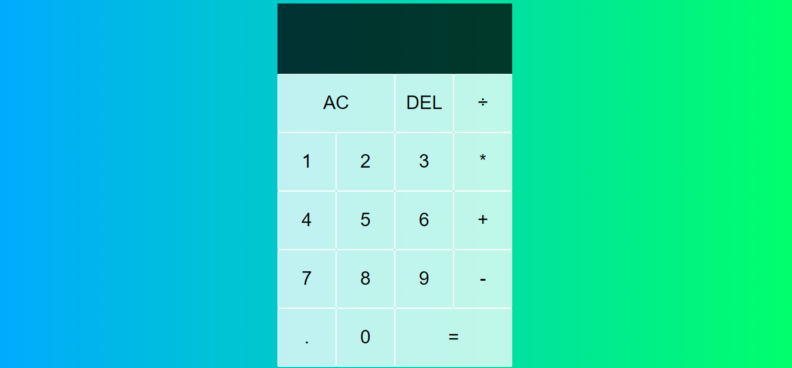

<h3 align="center">
    
</h3>

<h1 align="center"> Calculadora com JavaScript </h1>

## Features
Para o desenvolvimento do projeto foi utilizada as seguintes tecnologias:

- 💹 **HTML** — é uma linguagem de marcação utilizada na construção de páginas na Web;
- 💹 **CSS** — é um mecanismo para adicionar estilo (cores, fontes, espaçamento, etc.) a um documento web;
- 💹 **JAVASCRIPT** — é uma linguagem de programação interpretada estruturada, de script em alto nível com tipagem dinâmica fraca e multiparadigma;

## Objetivo

Melhorar o conhecimento da tecnologias acima sitadas